# AI-Based Early Warning & Landslide Risk Monitoring System in NER
**Ministry of Development of North Eastern Region (MDoNER) — Problem Statement ID: 26001**

[](https://www.python.org/)
[](https://fastapi.tiangolo.com/)
[](https://scikit-learn.org/)
[](https://leafletjs.com/)
[](https://sqlite.org/)
[]()
[](https://github.com/ranjithbrs/ner-landslide-early-warning/actions/workflows/ci.yml)
[](PORTFOLIO.md)
[](LICENSE)

---

## 1. Problem Statement Overview

The **North Eastern Region (NER)** of India—encompassing Arunachal Pradesh, Assam, Manipur, Meghalaya, Mizoram, Nagaland, Sikkim, and Tripura—faces frequent landslides, flash floods, highway blockages, and slope failures. Triggered by intense monsoons, fragile Himalayan and Indo-Burman geology, seismic activity, and steep road cuts, these disasters repeatedly sever strategic lifelines (such as NH-10 in Sikkim, NH-29 in Nagaland, NH-6 in Meghalaya, and NH-27 in Assam) and isolate vulnerable remote habitations.

Existing disaster management relies primarily on reactive reporting. This project develops an **AI-powered early warning and real-time monitoring platform** capable of:
1. Ingesting multi-factor data (terrain geomorphology, meteorological precipitation, and IoT ground sensor telemetry).
2. Using AI/ML models to compute spatial susceptibility and dynamic multi-stage early warnings (Green, Yellow, Orange, Red).
3. Visualizing risk zones, road blockages, and sensor networks on an interactive Leaflet GIS dashboard.
4. Enabling citizen and field official crowdsourced geo-tagged hazard reporting with offline-first synchronization.
5. Providing District Disaster Management Authorities (DDMA) and State Disaster Management Authorities (SDMA) with actionable decision support.

---

## 2. Key Capabilities & System Features

- 🛰️ **Multi-Source Data Ingestion Engine**: Synthesizes DEM terrain derivatives, IMD precipitation patterns (24h rainfall, 72h antecedent rainfall, storm intensity), and IoT telemetry (volumetric soil moisture %, pore water pressure, biaxial tilt rate).
- 🧠 **Dual-Tier ML Hazard Prediction Engine**:
  - **Tier 1 (Spatial Susceptibility)**: Random Forest Classifier trained on regional geomorphology producing baseline failure probability (Very Low to Very High).
  - **Tier 2 (Dynamic Early Warning)**: Real-time calculation of the **Dynamic Landslide Hazard Index (DLHI)** combining spatial vulnerability with empirical rainfall-intensity thresholds, saturation ratio, and ground deformation velocity.
- 🗺️ **Interactive Tactical GIS Dashboard**:
  - Built with Leaflet.js, featuring **Esri Dark Gray Tactical Canvas** and **Esri World Satellite Topography** (zero watermark).
  - High-visibility hazard polygons, glowing beacon pins (`⚠️`), critical highway lines (Open, Single-lane, Risky, Blocked), and pulsing IoT ground sensors.
  - Camera centroid automatically locked to the North Eastern Region (`[25.85°N, 93.20°E]`) with smooth fly-to zooms for specific corridors.
- 🧪 **Live ML Stress Simulation Sandbox**: Interactive sliders allowing emergency operators to simulate storm scenarios (e.g. 180mm rain, 95% soil moisture) and observe the ML model recalculate risk and update warning protocols in real time.
- 📝 **Crowdsourced Field Hazard Reporting**: Form for citizens and field officers to report tension cracks, rockfalls, or road blockages with GPS coordinates, auto-committed to SQLite and placed on the map without page refresh.

---

## 3. End-to-End System Architecture

```mermaid
flowchart TD
    subgraph DataSources [Multi-Source Data Ingestion]
        D1[DEM Derivatives: Slope, Aspect, TWI, Curvature]
        D2[IMD Weather Telemetry: 24h & 72h Antecedent Rain]
        D3[IoT Ground Telemetry: Moisture, Pore Pressure, Tilt]
        D4[Citizen & Field Official Hazard Reports]
    end

    subgraph MLEngine [Machine Learning & Prediction Core]
        M1[ColumnTransformer: Median Impute + StandardScale + OneHot]
        M2[Random Forest Classifier: Spatial Susceptibility]
        M3[Dynamic Hazard Index DLHI Calculator 0 - 100]
        M4[Early Warning Router: Green / Yellow / Orange / Red]
    end

    subgraph BackendAPI [FastAPI Modular Backend Services]
        B1[GET /api/v1/risk/zones - OGC GeoJSON Polygons]
        B2[GET /api/v1/roads/geojson - LineStrings with Status]
        B3[GET /api/v1/sensors/geojson - IoT Station Points]
        B4[POST/GET /api/v1/reports - Crowdsourced Hazard Sync]
        B5[GET /api/v1/health - System Diagnostics]
    end

    subgraph FrontendUI [Responsive Interactive GIS Dashboard]
        F1[Leaflet.js Viewport: Esri Dark Canvas & Satellite]
        F2[Vulnerable Corridor Ranking Matrix]
        F3[Interactive ML Stress Simulation Sandbox]
        F4[Field Hazard Submission Drawer & Feed]
    end

    DataSources --> MLEngine
    MLEngine --> BackendAPI
    BackendAPI <--> FrontendUI
```



---

## 4. Machine Learning Pipeline Deep-Dive

### 4.1 Prototype / Simulated Dataset

> [!NOTE]
> **Dataset Grounding**: The dataset was synthetically generated using empirical geomorphological and hydrological probability distributions calibrated to 15 representative vulnerable corridors across the 8 NER states (including NH-10 Sevoke–Gangtok, NH-29 Dimapur–Kohima, NH-6 Shillong Cut, and NH-27 Lumding–Haflong). It is intended for software development, pipeline verification, and architecture prototyping, and does not claim to be classified Geological Survey of India (GSI) field records.

- **Total Samples**: 6,000 observations (4,800 train / 1,200 holdout test).
- **Featurization Ordering**: Split **before** fitting imputers, encoders, and scalers to eliminate data leakage.
- **Class Balance**: 24.3% positive landslide failure rate.

### 4.2 Feature Dictionary

| Category | Feature | Unit / Type | Description & Physical Rationale |
| :--- | :--- | :--- | :--- |
| **Terrain (DEM)** | `elevation_m` | Meters | Altitude above sea level (50 – 3,500m). |
| | `slope_deg` | Degrees | Slope gradient (0° – 75°); primary driver of gravitational shear stress. |
| | `aspect_deg` | Degrees | Compass facing (0° – 360°); dictates moisture retention and windward monsoon impact. |
| | `profile_curvature`| Dimensionless | Surface curvature parallel to slope; concavities promote water convergence. |
| | `plan_curvature` | Dimensionless | Surface curvature perpendicular to slope; governs runoff concentration. |
| | `topographic_wetness_index` | Real | $\ln(a / \tan \beta)$; catchment wetness accumulation index. |
| | `dist_to_fault_m` | Meters | Distance to geological thrusts/faults; rock mass fracture proximity. |
| | `dist_to_drainage_m`| Meters | Distance to river courses; toe undercutting by fluvial erosion. |
| | `lithology_code` | Categorical | Rock strength (1: Alluvium, 2: Sandstone/Shale, 3: Flysch, 4: Schist, 5: Gneiss). |
| | `lulc_code` | Categorical | Land use (1: Dense Forest, 2: Scrub, 3: Road Cut / Bare Slope, 4: Settlement). |
| **Hydrometeorology** | `rainfall_24h_mm` | mm | Immediate storm precipitation triggering pore pressure spikes. |
| | `rainfall_72h_antecedent_mm`| mm | Cumulative antecedent rainfall pre-saturating the regolith. |
| | `rainfall_intensity_mm_h` | mm/hr | Short-duration deluge rate. |
| **Ground Telemetry**| `soil_moisture_pct`| % | Volumetric water content (10% – 98%); critical above 75–80%. |
| | `pore_water_pressure_kpa` | kPa | Piezometric void pressure directly reducing effective normal stress. |
| | `tilt_rate_mm_h` | mm/hr | Inclinometer displacement velocity signalling shear deformation. |

### 4.3 Model Comparison & Evaluation Results

Evaluated on the independent holdout test set ($N=1,200$ samples):

| Metric | Naive Baseline (Majority) | Logistic Regression Baseline | **Random Forest Classifier (Production)** |
| :--- | :---: | :---: | :---: |
| **Accuracy** | 75.67% | 97.50% | **94.92%** |
| **Precision** | 0.00% | 94.56% | **85.11%** |
| **Recall (Sensitivity)** | 0.00% | 95.21% | **95.89%** |
| **F1-Score** | 0.0000 | 0.9488 | **0.9018** |
| **ROC-AUC Score** | 0.5000 | 0.9970 | **0.9934** |
| **5-Fold Cross-Validation** | N/A | $0.9968 \pm 0.0006$ | **$0.9939 \pm 0.0010$** |

> [!IMPORTANT]
> **Why Recall is Paramount**: In natural hazard forecasting, **False Negatives are life-threatening** (failing to sound an alarm before a catastrophic failure). The production Random Forest model achieves a **95.89% Recall**, correctly predicting 280 out of 292 test failure incidents.

### 4.4 Top Feature Importances
```
1. rainfall_72h_antecedent_mm   24.13%  ████████████████████████
2. rainfall_24h_mm              20.89%  ████████████████████
3. rainfall_intensity_mm_h      19.31%  ███████████████████
4. soil_moisture_pct            17.11%  █████████████████
5. pore_water_pressure_kpa      10.01%  ██████████
6. slope_deg                     1.68%  █
7. tilt_rate_mm_h                1.54%  █
8. dist_to_fault_m               0.91%  ▌
```

### 4.5 Dynamic Landslide Hazard Index (DLHI) Formulation

Real-time early warning levels are computed using a multi-variable stress index:

$$\text{DLHI} = 0.35 \times (\text{Prob}_{\text{ML}} \times 100) + 0.30 \times \min\left(\frac{R_{24\text{h}}}{R_{\text{crit}}} \times 100, 120\right) + 0.20 \times \min\left(\frac{SM_{\%}}{SM_{\text{crit}}} \times 100, 120\right) + 0.15 \times \min\left(\frac{\dot{\theta}}{2.0} \times 100, 150\right)$$

- 🟢 **GREEN ($\text{DLHI} < 30$)**: Normal surveillance. No immediate slope threat.
- 🟡 **YELLOW ($30 \le \text{DLHI} < 50$)**: Advisory. Saturated soil and steady rain; caution for mountain motorists.
- 🟠 **ORANGE ($50 \le \text{DLHI} < 75$)**: Alert. High hazard; restrict heavy freight and place emergency teams on standby.
- 🔴 **RED ($\text{DLHI} \ge 75$)**: Critical Warning. Imminent slope collapse; trigger sirens, close highway, evacuate settlements.

---

## 5. Project Directory Structure

```
ner-landslide-early-warning/
├── backend/
│   ├── app/
│   │   ├── api/v1/
│   │   │   ├── endpoints/
│   │   │   │   ├── health.py        # Diagnostic check (DB connectivity & model state)
│   │   │   │   ├── risk.py          # /predict, /zones (GeoJSON), /summary
│   │   │   │   ├── sensors.py       # /readings, /latest, /geojson
│   │   │   │   ├── roads.py         # /roads, /geojson (LineStrings with status)
│   │   │   │   ├── reports.py       # /reports (POST/GET), /geojson, /batch-sync
│   │   │   │   └── alerts.py        # /alerts (dispatched warning logs)
│   │   │   └── router.py            # Central aggregated API v1 router
│   │   ├── core/
│   │   │   ├── config.py            # Pydantic Settings & environment manager
│   │   │   └── database.py          # SQLite connection manager & initial seeding
│   │   ├── ml/
│   │   │   ├── schemas.py           # Typed Pydantic schemas (Terrain, Meteo, Geotech)
│   │   │   ├── interface.py         # BaseLandslideModel contract & factory
│   │   │   └── service.py           # Production TrainedLandslidePredictor service
│   │   ├── models/
│   │   │   └── schemas.py           # Request & response validation schemas
│   │   └── main.py                  # FastAPI app entrypoint, lifespan & static mount
│   └── ml_engine/
│       ├── synthetic_generator.py   # Calibrated prototype data generator
│       ├── pipeline.py              # Scikit-learn ColumnTransformer preprocessor
│       ├── train.py                 # Training, cross-validation & model comparison
│       └── models/
│           ├── landslide_rf_model.joblib # Serialized Random Forest pipeline
│           └── model_metadata.json       # Metrics, confusion matrix, feature ranking
├── frontend/
│   ├── css/
│   │   └── styles.css               # Tactical dark GIS emergency response stylesheet
│   ├── js/
│   │   └── app.js                   # Leaflet map engine, layer manager, and simulation sandbox
│   └── index.html                   # Dashboard shell with #gis-map container
├── config/
│   └── .env.example                 # Environment configuration template
├── data/
│   ├── raw/                         # Raw simulated dataset (CSV)
│   ├── processed/                   # Train and Test partitions (CSV)
│   └── landslide_system.db          # Active SQLite database file
├── tests/
│   ├── test_foundation.py           # Foundation & database tests (7 passed)
│   ├── test_ml_pipeline.py          # ML data, training & prediction tests (6 passed)
│   └── test_gis_endpoints.py        # OGC GeoJSON endpoint tests (5 passed)
├── requirements.txt                 # Pinned Python dependencies
└── README.md                        # Documentation
```

---

## 6. Getting Started

### 6.1 Prerequisites
- Python 3.10 to 3.14 (tested on Python 3.14.3)
- Windows, macOS, or Linux

### 6.2 Installation
```bash
# 1. Clone repository
git clone https://github.com/ranjithbrs/ner-landslide-early-warning.git
cd ner-landslide-early-warning

# 2. Set up virtual environment
python -m venv .venv

# On Windows:
.venv\Scripts\activate
# On macOS/Linux:
source .venv/bin/activate

# 3. Install dependencies
pip install -r requirements.txt
```

### 6.3 Run the Application

#### Option A: One-Click Launch (Windows)
Double-click `run.bat` or execute in PowerShell:
```powershell
.\run.ps1
```
*This automatically activates your environment, verifies the ML model artifact, starts the Uvicorn server, and opens your default browser directly to the tactical GIS dashboard.*

#### Option B: Manual CLI
```bash
# Start the FastAPI server (serves both REST API and Frontend Dashboard)
python -m uvicorn backend.app.main:app --host 127.0.0.1 --port 8000 --reload
```

#### Option C: Docker Container
```bash
# Build and run the container
docker build -t ner-landslide-system .
docker run -d -p 8000:8000 --name landslide-app ner-landslide-system
```

- **Live Dashboard**: Open [http://127.0.0.1:8000/](http://127.0.0.1:8000/) in your browser.
- **Interactive Swagger Docs**: Open [http://127.0.0.1:8000/docs](http://127.0.0.1:8000/docs).
- **Health Check API**: [http://127.0.0.1:8000/api/v1/health](http://127.0.0.1:8000/api/v1/health).

---

## 7. Automated Test Suite

Run the full pytest suite across all modules:

```bash
pytest tests/ -v
```

### Verification Results (18 Passed):
```
tests/test_foundation.py::test_settings_loaded PASSED                    [  5%]
tests/test_foundation.py::test_database_tables_exist PASSED              [ 11%]
tests/test_foundation.py::test_health_check_endpoint PASSED              [ 16%]
tests/test_foundation.py::test_ml_schemas_and_fallback_predictor PASSED  [ 22%]
tests/test_foundation.py::test_incident_reporting_workflow PASSED        [ 27%]
tests/test_foundation.py::test_sensor_telemetry_workflow PASSED          [ 33%]
tests/test_foundation.py::test_frontend_static_serving PASSED            [ 38%]
tests/test_gis_endpoints.py::test_risk_zones_geojson_structure PASSED    [ 44%]
tests/test_gis_endpoints.py::test_road_corridors_geojson_structure PASSED [ 50%]
tests/test_gis_endpoints.py::test_sensors_geojson_structure PASSED       [ 55%]
tests/test_gis_endpoints.py::test_reports_geojson_structure PASSED       [ 61%]
tests/test_gis_endpoints.py::test_risk_summary_endpoint PASSED           [ 66%]
tests/test_ml_pipeline.py::test_synthetic_dataset_properties PASSED      [ 72%]
tests/test_ml_pipeline.py::test_preprocessing_pipeline_fit_transform PASSED [ 77%]
tests/test_ml_pipeline.py::test_trained_model_loading_and_metrics PASSED [ 83%]
tests/test_ml_pipeline.py::test_prediction_service_high_risk_scenario PASSED [ 88%]
tests/test_ml_pipeline.py::test_prediction_service_low_risk_scenario PASSED [ 94%]
tests/test_ml_pipeline.py::test_api_predict_endpoint_live PASSED         [100%]

======================= 18 passed in 5.59s =======================
```

---

## 8. REST API Endpoints Reference

| Method | Endpoint | Description | Sample Output |
| :--- | :--- | :--- | :--- |
| `GET` | `/api/v1/health` | System health & model status | `{"status": "healthy", "ml_service_status": "loaded"}` |
| `GET` | `/api/v1/risk/summary` | Regional hazard summary & highest risk zone | Top corridor, active warnings breakdown |
| `GET` | `/api/v1/risk/zones` | Monitored slope catchments as GeoJSON | Polygons styled with ML DLHI scores |
| `POST` | `/api/v1/risk/predict` | Real-time AI prediction for input features | Susceptibility %, DLHI score, Warning stage |
| `GET` | `/api/v1/roads/geojson`| Mountain highway corridors as GeoJSON | LineStrings with blockage & risk status |
| `GET` | `/api/v1/sensors/geojson`| IoT ground monitoring telemetry as GeoJSON | Points with moisture %, pore pressure, tilt |
| `POST` | `/api/v1/reports/` | Submit crowdsourced field hazard report | Persists to SQLite, drops GIS pin |
| `GET` | `/api/v1/reports/geojson`| Field observations as GeoJSON | Hazard markers with severity & descriptions |
| `POST` | `/api/v1/reports/batch-sync`| Offline-queued reports bulk ingestion | Syncs records captured with zero connectivity |

---

## 9. Hackathon / Stakeholder Alignment

- **Ministry**: Ministry of Development of North Eastern Region (MDoNER)
- **Theme**: Disaster Management
- **Target Beneficiaries**:
  - District Disaster Management Authorities (DDMAs across the 8 NER states)
  - Border Roads Organisation (BRO) & State PWDs
  - National Disaster Response Force (NDRF 1st & 12th Bns)
  - Local mountain communities and commercial transit operators

---

## 10. License

This project is licensed under the MIT License - see the [LICENSE](LICENSE) file for details.
